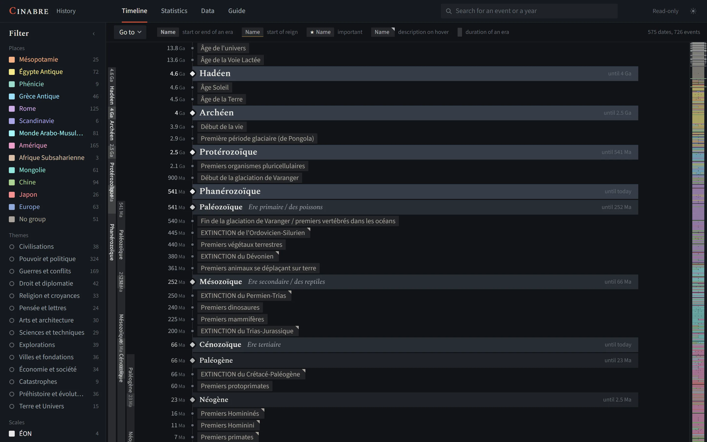

# Cinabre


[](LICENSE)

A tool to build your own timelines, over a few years or over billions: a revolution day by day, the history of a
country or a family, or everything since the Big Bang. You enter your dates and events, sort them by place and theme,
link the start of an era to its end, and Cinabre turns them into a timeline to read, filter and explore.

Cinabre runs on your computer: a small Python server, a page in your browser, one JSON file per timeline. No account,
no connection, no dependency. On first launch, an empty timeline is waiting for you.

**[See an example](https://lenavarque.github.io/cinabre/)**: a world history timeline made with Cinabre
([and another one on the French Revolution](https://lenavarque.github.io/cinabre/revolution/)), in the complete
application, read-only. The events themselves are written in French; the interface is in English.



*[Résumé en français plus bas.](#en-français)*

## What it does

- **Timeline**: one line per date with its events side by side, eras as vertical ribbons, the great periods (eons,
  geological eras, historical periods) as special lines, and a minimap to move around.
- **Filter** by place and theme, **search** names and descriptions.
- **Statistics**: the number of events per range of years and per place.
- **Data**: tables to add and correct events, link a start date to an end date, edit several events at once or paste
  a whole list in one go; undo with Ctrl+Z.
- Dates to the year, month or day, approximate or not, down to billions of years ("2.9 Ga").
- Several timelines in the same folder, with an automatic backup copy each time you save.
- **Export** a timeline as a single read-only HTML page that opens in any browser.
- English or French interface, light or dark theme, and a built-in guide.

## Installation

You need Python 3.9 or later, and nothing else. Download the repository (*Code* → *Download ZIP*, or `git clone`),
then, in its folder:

```bash
python serveur.py
```

The page opens in your browser at <http://127.0.0.1:8765>. On first launch an empty timeline is created
(`dates.json`): it is yours. The interface follows your browser's language (English or French; *FR · EN* at the top
right switches it), and the built-in *Guide* tab explains the rest.

The empty timeline comes with a set of French starting themes. For English ones, create a new timeline from the
timeline menu (next to the Cinabre name) with the interface in English.

Options:

| Option | Purpose |
|---|---|
| `--port 9000` | use another port (if 8765 is taken, the next 9 are tried) |
| `--fichier my-timeline.json` | open another data file |
| `--sans-navigateur` | do not open the browser |

The server only listens to your own computer (127.0.0.1). Your data stays in the folder, with backup copies in
`sauvegardes/`.

## What is in the repository

| File | Purpose |
|---|---|
| [serveur.py](serveur.py) | the local server (Python standard library only) |
| [web/](web/) | the interface: HTML, CSS and JavaScript modules, with no library and no build step |
| [demo/](demo/) | the two example timelines, exported read-only, in English and in French |

## The data

A timeline is a readable JSON file: groups (places and scales, with their colour), themes, periods (eras and special
lines) and dates, each with its events. It is edited in the *Data* tab, but nothing stops you from opening it in a
text editor too. Cinabre never translates your data: names and descriptions stay as you wrote them.

## The example pages

They are published on GitHub Pages at each push to `main` by the [pages.yml](.github/workflows/pages.yml) workflow
(repository setting: Settings → Pages → Source: GitHub Actions), in English at the root and in French under
[/fr/](https://lenavarque.github.io/cinabre/fr/). They are pages exported from Cinabre: the whole application, where
everything can be browsed, tables included, but nothing can be changed (the data is frozen).

## Licence

[MIT](LICENSE). The Spectral and Source Sans 3 fonts are under the SIL Open Font License.

## Contributing

Comments and suggestions are welcome: see [CONTRIBUTING.md](CONTRIBUTING.md). Changes are listed in
[CHANGELOG.md](CHANGELOG.md). The code, its comments and variable names are in French.

## En français

*Cinabre* est un outil pour construire ses propres frises chronologiques, sur quelques années comme sur des milliards :
on y note ses dates et ses évènements, on les classe par lieu et par thème, on relie le début d'une époque à sa fin, et
on la lit comme une frise. Il tourne sur votre ordinateur (`python serveur.py`, bibliothèque standard seule, puis
<http://127.0.0.1:8765>), garde chaque frise dans un fichier JSON lisible, et propose des statistiques, la
modification en série, l'annulation, l'export en page HTML, un thème clair et un thème sombre, et une interface en
français ou en anglais. [Exemples en français](https://lenavarque.github.io/cinabre/fr/) (en lecture seule).
Licence MIT ; le code et ses commentaires sont en français.
